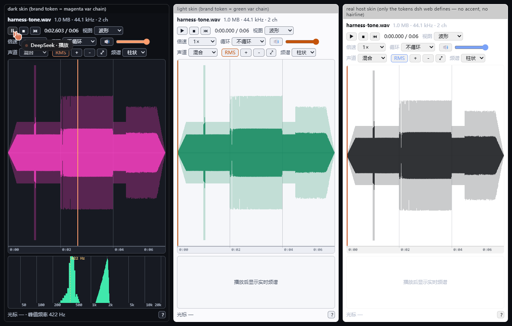
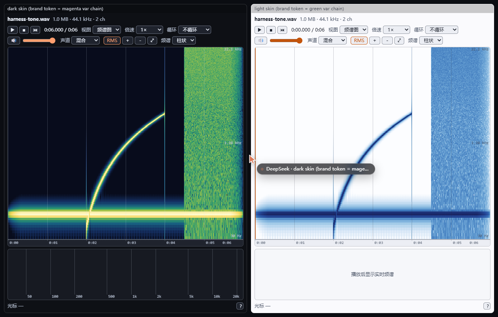
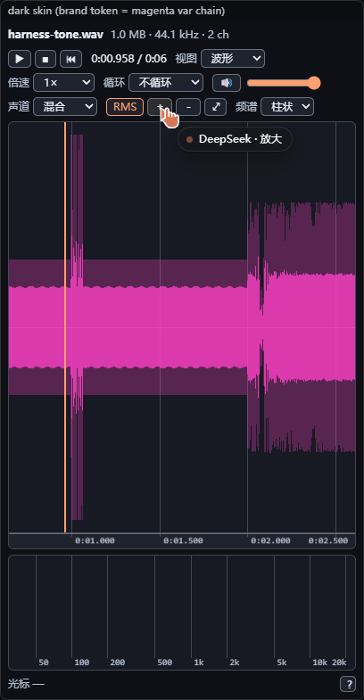
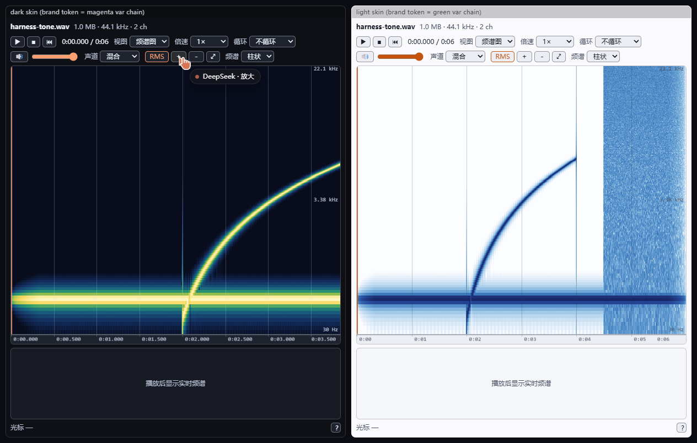

<p align="center">
  <a href="https://dshfind.com/zh/plugins/huanlinoto/dsh-plugin-better-sidebar-plugin-audio"></a>
</p>

# dsh-plugin-better-sidebar-plugin-audio

给 [dsh-better-sidebar](https://github.com/omdsh-dev/DSH-better-sidebar) 的**音频预览**：在 DSH 右侧栏里直接播放音频，看波形、拖进度、量选区、查实时频谱与全曲频谱图。

DSH 自己的文档预览把 `mp3/wav/flac/ogg/m4a/aac/wma/opus` 列在「已知二进制、无渲染器」表里——打开音频只能看到「暂不支持预览」。这个插件把这块空白补上：它向 better-sidebar 注册一个音频文件预览器，并自带一条支持 HTTP Range 的媒体路由，所以**任意大小**的音频都能流式播放、拖动进度条。

| 三种皮肤下的波形（暗 / 亮 / 仿真真实宿主）+ 实时频谱 | 全曲频谱图 |
| --- | --- |
|  |  |

图都来自本仓库自带的浏览器验证台（见下文「视觉验证台」），不是示意图。最右一列是**仿真真实宿主皮肤**——只写宿主真正定义的那几个令牌，故意**没有** `--dsw-alias-accent` / `--dsw-alias-hairline`，且 brand 与 label 同色：它专门盯住「缺失令牌被当成解析成功」与「RMS 与波形糊成一块」这两类**只在真实宿主上才会出现**的问题（上面两列定义了全部令牌，永远看不出来）。放大后细节随缩放增长：

| 放大后的波形（暗色皮肤，视窗 0–1.97 s，可见 1.0–1.07 s 的 click 簇） | 放大后的频谱图（mel 轴、无插值） |
| --- | --- |
|  |  |

## 功能

| 区域 | 能力 |
| --- | --- |
| 波形 | **两层**绘制：淡色**峰值带**（每列 `[min, max]` 全跨度）垫底、深色 **RMS 主体**压在上面，同色相两个 alpha，绝不会用同一种颜色；时间标尺自适应（1 ms – 1 h）；点击/拖动定位（scrub）；滚轮以指针为中心缩放；`Alt`+拖动平移；双击适配全曲；缩放/平移/适配按钮 |
| **全曲频谱图** | 按**当前视窗**重算 STFT（Hann 窗、1024 点 FFT、**mel 频率轴** 30 Hz–Nyquist、关闭插值绘制），放大后细节随之变多，而不是把几格粗单元拉糊，与波形**共用同一条时间轴**：缩放、平移、播放头、选区全部同步；高峰值与扫频一眼可见 |
| 实时频谱 | 播放时的 FFT（2048、对数轴）：**柱状 / 折线 / 瀑布**三种风格，或关闭（关闭后不占高度）；频率刻度 + 峰值频率标记 + 光标频率读数；未播放时给一句提示而不是空框 |
| 播放 | 播放 / 暂停 / 停止 / 重播；空格、`←`/`→`（±5 s，`Shift` 为 ±1 s）、`Home`/`End`；音量 + 静音（`M`）；倍速 0.25×–3× |
| 循环 | 关闭 / 整曲循环 / 选区 A-B 循环（`L` 轮换）；A-B 回绕在播放头越过终点时精确跳回 |
| 选区 | `Shift`+拖动框选；实时读数：区间（含毫秒）、时长、**峰值 dBFS**、**RMS dBFS** |
| 声道 | 混合 / 左 / 右 / 任意声道独立包络（解码时按声道分别求包络，混合视图按均方合成） |
| 大文件 | 播放始终走 `<audio>` + Range 流式（不整包解码）；**打开即自动解码**，没有手动按钮：波形包络与下混 PCM 一次算好（约 176 KB/秒），频谱网格再按视窗重算；超过 30 分钟的文件只做流式播放并说明原因 |
| 降级 | 浏览器解码不了（如 wma）→ 明确提示而不崩；Web Audio 不可用 → 频谱停用但播放照常；路由/读取失败 → 浮层提示原因 |

## 交互与布局上的几个刻意决定

- **界面文字不可选中**（`user-select: none`），只有文件名与错误详情例外——否则在波形上拖动会拖出一片蓝色选区。
- **读数行只有一行**（固定 18 px + 省略号），快捷键与操作说明收进右下角的 `?` 按钮；提示以**浮层**显示而不是插入文档流。侧栏高度不会被一串会变长的文本顶来顶去。
- **画布完全填满主区域**：canvas 绝对定位并按 CSS 盒测量，主区域吃掉所有富余高度——不会在固定高度画布下面留出死白。
- **缩放让频谱图变清楚**：热图不是「整曲算一次然后拉伸」，而是每次视窗变化后（去抖 120 ms）按视窗重算，列数就等于画布像素宽——放大 10 倍，时间分辨率也细 10 倍。
- **配色跟随皮肤**：canvas 画不了 `var()`，所以每个令牌都通过探针元素让**浏览器**算一遍再交给画布（宿主的令牌常是 `var()` 链，直接读自定义属性会拿到字面量，画布会静默丢弃它 → 这就是「字看不清」的经典成因）。暗/亮皮肤各有一套回退色，图例、网格、色带都随之反转。探针**只探 `color`，绝不探 `background-color`**：后者自身的初始值就是 `transparent`，令牌缺失时它照样回一个 `rgba(0, 0, 0, 0)`，会被当成「解析成功」而跳过回退——播放指示条、网格线、选区框于是全拿到一个「什么都不画」的颜色。宿主亮色皮肤恰好没有 `--dsw-alias-accent` / `--dsw-alias-hairline`，这个坑是被真实侧栏量出来的。
- **波形是两层，而且两层必须不同色**：把每列 `[low, high]` 用**不透明**波形色整段填满是最顺手的写法，却在最常见的场景里最错——一首已归一化的歌整曲一屏时，每列几乎都顶到满幅，主区域糊成**一块同色实心方块**（真实侧栏实测：85.5% 的已绘制像素是同一个不透明近黑），压在下面的 RMS 被完全埋掉。反过来只画每列的端点两个像素也不对：整曲视图下每列覆盖 0.33 秒，相邻列极值跳变剧烈，于是每个瞬态都孤立地飘在主体外面，整片主区域变成**散落的碎点**。现在两层都填满、但用同色相的两个 alpha：**淡色峰值带**（亮皮 0.22 / 暗皮 0.28）在下、**深色 RMS 主体**（0.82 / 0.78）在上，瞬态与能量的层次清楚，既没有同色糊块，也没有碎点。

## 安装

本仓库按 **bundle 形式**发布（host 半 + client 半 + `cordis.patch.yml`），`lib/` 预构建入库，`github:` 安装开箱即用：

```powershell
# 本地开发（改完源码重建 lib/ 即可，无需重装）
dsh plugin --profile web add "link:D:/Projects/deepseek-harness/dsh-plugin-better-sidebar-plugin-audio"

# 远端分发
dsh plugin --profile web add "github:huanlinoto/dsh-plugin-better-sidebar-plugin-audio"

# npm
dsh plugin --profile web add "@huanlin/dsh-plugin-better-sidebar-plugin-audio"
```

安装后**重启 `dsh web`**，浏览器硬刷新（`Ctrl+Shift+R`），然后在文件树里点任意 `.mp3` / `.wav` / `.flac` 等文件。

## 工作原理

```
host 半  src/index.ts ─┬─ /audio-preview/meta?sessionId&path   → { name, size, mime, path }
                       └─ /audio-preview/media?sessionId&path  → 字节流，支持 Range → 200 / 206 / 416
client 半 src/client/index.tsx → ctx.betterSidebar.registerFileViewer({ exts: AUDIO_EXTS, priority: 50 })
          src/client/AudioViewer.tsx → <audio>(流式播放) + AnalyserNode(实时频谱) + canvas(波形/频谱图)
```

三个关键取舍：

1. **为什么自建媒体路由**：better-sidebar 的 `/sidebar/file` 把整文件读进内存、回普通 `200`（无 `Accept-Ranges`，浏览器因此禁用拖动进度）、且受该插件 20 MB `mediaLimit` 限制。波形播放器三个都踩雷，所以 host 半用 `createReadStream` 流式响应 `Range`（含开放端与后缀写法），无法满足时回 `416` + `Content-Range: bytes */size`。
2. **为什么不用 `decodeAudioData` 播放**：整曲解码成 PCM 会吃掉「时长 × 352 KB/s」的内存（5 分钟立体声 ≈ 105 MB）。播放走 `<audio>` 元素，Web Audio 只负责分析器与一次性的波形包络 + 下混 PCM（约 176 KB/s，供频谱图与深放大的波形按视窗重算），解出的 `AudioBuffer` 立即丢弃。
3. **波形缩放的两级包络**：整曲包络是固定 4000 列，绘制时按视窗裁剪聚合（`drawWaveform` 把画布列的时间片映射到包络列区间）；一旦视窗内可用列数少于画布像素，就改用下混 PCM **在渲染帧内同步重算**该视窗的包络（列数 = 画布像素），放大后细节随缩放增长、且不存在「先粗后细」的二次切换。只有超长录音深放大（视窗样本 > 2 M）才退到 120 ms 去抖后台重算。单声道视图没有保留逐声道 PCM，深放大时停留在裁剪的整曲包络上。
4. **播放指示条独立成层**：`timeupdate` 事件既粗（约 4 Hz）又不可靠（后台标签页会停发），因此 playhead 与悬停光标画在单独的覆盖层 canvas 上，由 `requestAnimationFrame` 直读 `element.currentTime` 驱动——播放/暂停/seek/播完四种状态下都平滑且正确，波形层也不再为指示条而整幅重绘。
5. **优先级**：`priority: 50`，高于内置 markdown/html（0）与 `code` 兜底（-100），因此音频**不会**落到文本编辑器或下载面板。

## 视觉验证台（dev/）

`dev/` 是一个自包含页面（不打进 npm 包）：用 Node 合成一段立体声 WAV（440 Hz 正弦 → 1 s 处一串 4 ms click → 2 秒扫频 → 噪声尾巴；click 簇专门用来检验深放大后包络是否真的从 PCM 重算），把真实组件**同时**渲染在暗色与亮色皮肤下。两套皮肤都把令牌写成 `var()` 链，正是画布无法自行解析的形状，所以波形颜色对不对一眼就能看出来。

```powershell
pnpm run harness           # node dev/build.mjs -> dev/bundle.js
# 用本地 HTTP 服务打开（file:// 下脚本根本不会被请求）：
node -e "require('http').createServer((q,s)=>require('fs').readFile('.'+decodeURIComponent(q.url.split('?')[0]),(e,d)=>e?(s.writeHead(404),s.end()):s.end(d))).listen(8613)"
# 浏览器访问 http://127.0.0.1:8613/preview.html
```

构建走 `dev/build.mjs`（esbuild JS API）而不是命令行 `--define`：Windows shell 会把 `"development"` 的引号剥掉，esbuild 随即把值当成**标识符**替换进产物，React 入口一执行就 `ReferenceError`——这个坑只在真正加载 bundle 时才暴露。

它也是排查这类问题的唯一可靠手段：本仓库修掉的「画布没填满主区域」与「亮色色带画在暗色皮肤上」两个问题，都是先在这里量出来的（`canvas.clientHeight` 与 `lane.clientHeight - 18` 是否相等、画布像素直方图里出现的是哪一套色带）。

## 开发

依赖解析靠 `tsconfig.json` 的 `paths` 指向 DSH 源码树（`@deepseek-ai/cordis`）与 better-sidebar 的类型产物；运行期不需要它们（client bundle 通过 DSH 的模块表 `require("react")` / `require("react/jsx-runtime")`）。

```powershell
pnpm install          # 首次；本目录自带 pnpm-workspace.yaml，是独立的安装根
pnpm run typecheck    # tsc --noEmit ×2（host 面 + 纯 client 面）
pnpm test             # vitest run（15 个 spec / 176 用例）
pnpm run build        # tsdown（host ESM + client CJS closure）+ tsc 生成 lib/types
pnpm run bundle:client # 只重打 client bundle（快速迭代）
```

```
src/
├─ index.ts             host 入口：注册媒体路由（inject: webServer, sessions, webRuntime）
├─ audio-route.ts       Range 解析、路径/cwd 解析、meta 与 media 处理
├─ trust-fence.ts       浏览器信任栅栏（Host 回环 / trustedHosts / Origin / sec-fetch-site）
├─ audio-exts.ts        扩展名与 MIME 的单一事实源（host 白名单 = client 注册表）
└─ client/
   ├─ index.tsx         client 入口：ctx.betterSidebar.registerFileViewer(...)
   ├─ AudioViewer.tsx   播放器面板（工具栏 + 主区域 + 实时频谱 + 读数行 + 交互/快捷键）
   ├─ player.ts         <audio> + AudioContext + AnalyserNode 引擎（惰性、可注入、可 dispose）
   ├─ decode.ts         按需抓字节（带进度/取消）+ 包络 + 频谱网格
   ├─ fft.ts            基-2 FFT、Hann 窗、单帧功率谱（纯函数）
   ├─ peaks.ts          峰值/RMS 包络（纯函数）
   ├─ spectrogram.ts    全曲 STFT 网格、频段映射、RGBA 渲染（纯函数）
   ├─ view.ts           视窗缩放/平移/刻度/时间格式（纯函数）
   ├─ selection.ts      选区统计与 A-B 回绕（纯函数）
   ├─ spectrum.ts       FFT bin ↔ 列映射、峰值频率、频率刻度（纯函数）
   ├─ waterfall.ts      瀑布缓冲与颜色映射（纯数据，可单测）
   ├─ draw.ts           canvas 绘制（波形/标尺/实时频谱/瀑布/频谱图）
   ├─ theme.ts          探针式令牌解析 + 明暗自适应调色板
   ├─ labels.ts         中英文案（按浏览器语言选择）
   └─ styles.ts         注入式样式表（全部令牌驱动，无硬编码颜色）
dev/
├─ main.tsx             验证台：合成 WAV + 双皮肤渲染
├─ preview.html         皮肤令牌（含 var() 链）与页面骨架
└─ shot-*.png           README 引用的实测截图
```

## 检查（本插件当前的验证状态）

- `pnpm run typecheck`：通过（strict + `noUncheckedIndexedAccess`，host 与 client 两面各一次）。
- `pnpm test`：**176 用例全绿**（15 个 spec），覆盖：
  - Range 解析（闭合 / 开放端 / 后缀 / 越界 / 非法 / 多段）；
  - 路由端到端（`200` / `206` + `Content-Range` / `416` / `HEAD` / `400` / `403` / `404` / `405`，含真实临时文件与流式响应落地）；
  - 信任栅栏矩阵（回环 / 受信 authority / 跨站标记 / 陌生 Origin / 不透明 Origin / 桌面壳 Origin / 缺 Host）；
  - 扩展名白名单与 MIME 映射（含 `/music.mp3/README.md`、dotfile 这类边界）；
  - 纯函数层：峰值包络与混合声道、选区统计（dBFS）、视窗缩放/平移/刻度、FFT（直流/正弦/非 2 幂拒绝）、全曲 STFT（440 Hz 落在正确频段、静音不归一化成满强度）、FFT 列映射与频率往返、瀑布环形缓冲、**波形视窗映射**（缩进取静音半段必须整幅变平、缩取响亮半段必须拉伸满幅、窗口包络按窗口原点映射——即「缩放不改波形」这一 bug 的回归断言）与**峰值必须是连续带**（每列一个横跨 `[min, max]` 的 1px 宽矩形，退回孤立端点即失败）、**两层必须不同色**（峰值带与 RMS 主体的 fillStyle 必须互不相同，同色回归即失败）及**RMS 主体必须落在峰值带之内**；
  - 配色契约（令牌缺失/未解析链路必须被拒、**引擎只回一个 `transparent` 背景也必须被拒**、已计算颜色必须透传、亮暗判定与回退选择、**RMS 必须与波形可区分**——皮肤把 brand 与 label 设成同色时仍不能糊成一块）；
  - client 注册契约（单 viewer、`exts` 与 `AUDIO_EXTS` 一致、优先级高于内置、`ctx.effect` 卸载回收、服务缺席时不抛错、`load()` 走插件路由、失败回退为可显示的错误）；
  - 组件渲染（jsdom + mock 引擎：工具栏、文件信息、播放/停止、空格键、视图切换与「需要先解码」空态、A-B 选项禁用态、浮层通知、错误面板、卸载即 `dispose`）。
- 产物冒烟（真实 HTTP）：`node` 加载 `lib/index.js` → 用真实 `http.createServer` 跑：`meta` 200、全量 200 + `accept-ranges: bytes`、`bytes=4-9` → 206 + `bytes 4-9/16`、`bytes=99-` → 416、跨站 403、非音频 403。
- client 产物契约：`window.__ModuleLoader__.load({ id: "@huanlin/dsh-plugin-better-sidebar-plugin-audio", factory: (require) => { ... } })`，specifier 仅 `react` 与 `react/jsx-runtime`。
- **浏览器实测**（`dev/` 验证台）：主区域富余 0 px、页面无溢出；波形像素取自各自皮肤的品牌令牌（暗=洋红、亮=深绿）；真实鼠标点击后实时频谱出现（峰值频率 422 Hz）、空态提示消失；频谱图视图画出 440 Hz 直线与 2–4 秒扫频斜线；拖动波形后 `window.getSelection()` 为空；频谱「关闭」后不再占用高度；**缩放后 `data-view` 收窄且波形像素哈希随之改变**（连续缩放后立即采样与 400 ms 后采样完全一致——同步包络重算没有「先粗后细」的二次切换）；深放大到 0.024–1.282 s 时 1.0–1.072 s 的 6 个 click 簇逐个可见（77–82% 列位），**播放指示条覆盖层**在同一视窗内以 104→207→314→419→525 px 单调移动并精确落在理论播放位置。
- **真实侧栏复核**（宿主亮色皮肤，文件 `Hanser - Cyberangel.mp3`，7.6 MB / 3:00，逐图层量像素）：修复前主区域 85.5% 的像素被绘制，其中 85.0% 是**同一个不透明近黑**、播放指示条覆盖层**每帧都在画却 0 个不透明像素**（颜色是全透明的）；修复后主区域是严格的两层：**淡色峰值带**（alpha 0.22，65.8% 的已绘制像素）铺满每列 `[min, max]`，**深色 RMS 主体**（合成 alpha 0.86，31.9%）压在其内，网格 0.5%，播放指示条 900 px 不透明橙红——seek 到 40% 落在 221.75 px（理论 221.0），播放中 221.75→226.75→231.75→236.75 px 单调移动且每帧像素数恒定；缩放后 `data-view` 收窄（0.000–180.480 → 40.407–132.813）且波形像素哈希改变、600 ms 后仍一致（无二次切换）。
- **挂载验证需要人工**（本项目约定不由 agent 启动 `dsh web`）：安装 + 重启 + 硬刷新后，文件树点开一个音频文件，应看到波形面板；拖动进度条应能跳转（证明 206 生效）。

## 安全

- 所有请求先过**浏览器信任栅栏**（与 DSH `/api` 网关、better-sidebar `/sidebar/*` 同语义）：Host 必须是回环或 `webRuntime.trustedHosts` 中的 authority；带 `sec-fetch-site: cross-site` 一律拒绝；带 `Origin` 时必须与 Host 主机名一致（桌面壳的 `dsh-app://app` 例外）。这是反 DNS-rebinding / 反跨站读取的栅栏，不是身份认证。
- 路由**只服务音频扩展名**（`audio-exts.ts` 白名单），拿不到别的东西——即使某个页面绕过了栅栏，它也无法把这条路由当作通用文件读取口。
- 只接受 `GET` / `HEAD`，只读，无写入面。
- 路径解析与 better-sidebar v0.23.0+ 一致：相对路径基于会话权威 `cwd`（会话头 → 调用方 `cwd` → `process.cwd()`），绝对路径原样，`~` 展开，**不做包含检查**（`cwd` 是基准而非边界）。越界读取不构成新增权限面：同源页面本来就能用 `/sidebar/api/fs.read` 读任意文件。

## 合规（对照 DSH 插件开发规范）

- **零源码 patch**：未修改 DSH checkout 任何文件；全部能力经 `cordis.patch.yml` + profile 机制挂载。
- **bundle 形式**：host 半 `lib/index.js`（ESM）+ client 半 `lib/client.js`（CJS closure，`window.__ModuleLoader__.load` 包裹）+ 自带 `cordis.patch.yml`（insert 行 `id/name` 齐全，`name` 为包名）。
- **预构建 `lib/` 入库**（含 `@deepseek-ai/*` peer 的插件必须如此），无 `prepare` 脚本，`github:` 安装开箱即用。
- **peer 声明**：`@deepseek-ai/cordis` / `dsh-better-sidebar` / `react` / `react-dom` 全为 peer 且 `optional`；运行时零 `@deepseek-ai/*` value import。
- **不导出 `default`**；`inject` 声明服务依赖，`ctx.effect` 包住注册以获得 HMR 安全卸载。
- 测试分层齐备（纯函数 / 契约 / 组件 / 端到端路由），`typecheck` + `test` + `build` 三个脚本齐全；`dev/` 与测试截图不进 npm 包（`files` 白名单）。
- 展示元数据：`package.json#icon` + `locale/zh.json` / `locale/en.json`（`meta.title` / `meta.description`），`exports` 暴露 `./package.json` 与 `./locale/*.json`。

## 已知限制

- **wma / amr**：Chromium 系浏览器没有解码器。插件会明确提示「解码失败」，播放也会失败——这是浏览器能力边界，不是渲染问题。
- 解码始终自动进行；只有超过 30 分钟的文件才跳过解码（仅流式播放），此时会明确说明原因，而不是留一个要你点的按钮。
- 频谱图按视窗重算（列数 = 画布像素、频段上限 512、mel 轴、最近邻绘制），细节随缩放增长；只有整曲一屏时受画布像素数约束。
- 单声道视图深放大时停留在裁剪的整曲 4000 列包络上（逐声道 PCM 不保留，只有下混单声道保留）；mix 视图无此限制。
- 频谱需要 Web Audio；不可用（或被策略禁用）时只提示并停用频谱，波形与播放不受影响。
- 视图状态（缩放、选区、声道、频谱风格、主视图）不跨标签页持久化——关掉再开回到默认全曲波形。

## License

MIT
